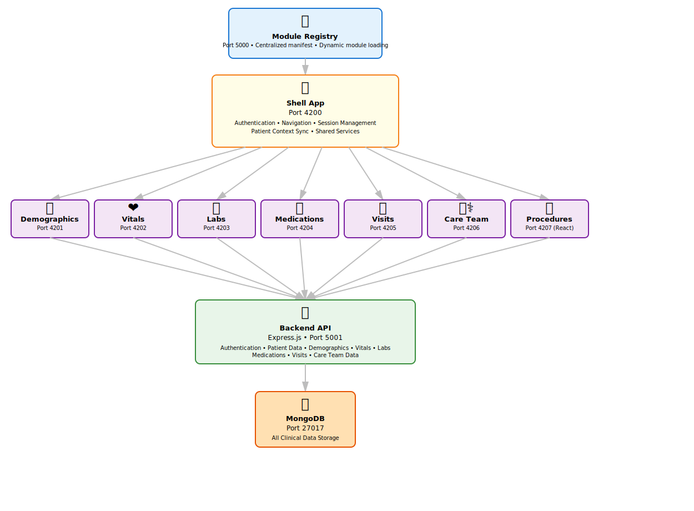

# PatientRecords - Micro-Frontend Medical Records System

[](https://github.com/sultanj-pro/PatientRecords/blob/main/LICENSE)

A modern, scalable healthcare information system built with Angular 17, Module Federation, and microservices architecture.

## 📋 Table of Contents

- [Overview](#overview)
  - [Module Federation Case Study](#-module-federation-case-study)
  - [Future Vision](#-future-vision)
- [Key Capabilities](#key-capabilities)
- [Technology Stack](#-technology-stack)
- [System Architecture](#system-architecture)
- [Quick Start](#quick-start)
- [Project Structure](#project-structure)
- [Features](#features)
- [Development](#development)
- [Deployment](#deployment)
- [API Documentation](#api-documentation)
- [Troubleshooting](#troubleshooting)
- [Roadmap](#roadmap)

## 🎯 Overview

PatientRecords is a next-generation electronic health record (EHR) system designed for modern healthcare delivery. Built on a micro-frontend architecture, it allows independent development, deployment, and scaling of clinical modules while maintaining a unified user experience.

### 🔬 Module Federation Case Study

**PatientRecords serves as a production-grade case study in Module Federation architecture**, demonstrating:

✅ **Positive Results:**
- Successfully running **6 Angular modules + 1 React module** in a single unified shell application
- Independent modules built with different frameworks coexist seamlessly via Module Federation
- Real-time cross-framework state synchronization (patient context, authentication)
- Modules maintain complete independence: deploy, update, and scale separately
- Shared dependencies managed efficiently—no duplication of React, Angular, or RxJS
- Deep-linking and navigation work across all framework types

**Key Finding:** Module Federation successfully enables true technology flexibility. Teams can adopt different frameworks based on module requirements, not organizational standards. This demonstrates the architectural maturity needed for enterprise-scale polyglot micro-frontend systems.

### 🚀 Future Vision

This foundation will evolve into:
- **Distributed Microservices Backend** — Multiple specialized services (Patient Service, Procedures Service, Analytics Service, etc.) replacing monolithic architecture
- **Agentic AI Integration** — Autonomous agents for clinical decision support, schedule optimization, and real-time alerts
- **Edge Computing** — Offline-capable modules with local-first architecture and cloud sync
- **Advanced Module Orchestration** — Dynamic module loading based on user roles, device capabilities, and network conditions

### Key Capabilities
- **Multi-framework micro-frontends** — 6 Angular modules + 1 React module via Module Federation
- **Multi-module clinical system** with demographics, vitals, medications, visits, labs, care team, and procedures
- **Shareable patient URLs** with deep-linkable module views (`/dashboard/:module/:patientId`)
- **Real-time patient context sync** across all modules using Observable pattern
- **Real-time session management** with automatic token refresh
- **Role-based access control** (RBAC) for clinical workflows
- **Framework-agnostic module loading** — load Angular or React modules dynamically
- **Responsive web design** for desktop and tablet use
- **Containerized deployment** using Docker and Docker Compose
- **Comprehensive API** with OpenAPI/Swagger documentation

## 🛠️ Technology Stack

### Frontend
- **Angular 17** — Shell application and 6 micro-frontend modules
- **React 18** — Procedures micro-frontend module demonstrating multi-framework support
- **Module Federation** — Multi-framework orchestration via @angular-architects/module-federation and Webpack Module Federation
- **TypeScript 5** — Type-safe JavaScript development
- **RxJS 7** — Reactive programming with Observables
- **Karma & Jasmine** — Unit testing framework
- **Nginx** — Reverse proxy and HTTP server for production deployments

### Backend
- **Node.js 18+** — JavaScript runtime environment
- **Express.js** — Lightweight web application framework
- **MongoDB with Mongoose** — NoSQL database and ODM
- **JWT (jsonwebtoken)** — Token-based authentication and authorization
- **Swagger/OpenAPI** — API documentation and validation
- **Jest** — Testing framework with coverage reporting

### Infrastructure & DevOps
- **Docker** — Containerization for consistent deployments
- **Docker Compose** — Multi-container orchestration
- **Docker Registry** — Private container image registry
- **PostgreSQL** — Relational database support for migrations
- **Alpine Linux** — Lightweight base images

### Build & Development Tools
- **Angular CLI 17** — Angular development and build tooling
- **Nx** — Monorepo management with task orchestration
- **npm Workspaces** — Monorepo organization

## 🏗️ System Architecture

### Micro-Frontend Design

The system uses Angular Module Federation to isolate clinical modules within a shell application:

<div align="center">



</div>

### Patient Context Sharing & URL-Based Routing

#### Shareable Patient URLs (Phase 6a)

Direct patient-module access with shareable URLs:

**URL Pattern**: `/dashboard/:module/:patientId`

Examples:
- `/dashboard/vitals/20001` - Vitals view for patient 20001
- `/dashboard/medications/20002` - Medications for patient 20002
- `/dashboard/labs/20003` - Lab results for patient 20003

**Key Features**:
- Copy/paste URLs to share specific patient views with colleagues
- Browser refresh preserves patient and module context
- Login flow preserves intended destination via `returnUrl`
- Patient selection updates URL while staying on current tab

**Cross-Module State Synchronization**:
- All modules watch `localStorage.__PATIENT_CONTEXT__` via RxJS Observable (500ms interval)
- Patient selection in one module instantly refreshes all other loaded modules
- No page refresh required when switching patients
- Type-safe patientId handling with explicit String conversion

**Implementation Details**:
- Dashboard component syncs from URL on both initial load and route changes
- Patient context stored in localStorage as single source of truth
- All modules implement identical Observable pattern for consistency
- URL navigation uses `navigateByUrl()` for full path preservation

### Authentication & Session Management

#### Token Refresh Strategy (Phase 5d)

Two-tier approach for uninterrupted user experience:

**Tier 1: Proactive Refresh**
- Client checks if JWT expiring within 5 minutes
- Automatically refreshes token before expiration
- User continues working without interruption

**Tier 2: Reactive Refresh**
- On any 401 response, attempt immediate token refresh
- Retry original request with new token
- Fallback to login only if refresh fails

**JWT Token Format**
```json
{
  "sub": "user_id",
  "email": "user@example.com",
  "roles": ["doctor", "admin"],
  "iat": 1234567890,
  "exp": 1234571490
}
```

**Expiration**: 1 hour (3600 seconds)
**Refresh Endpoint**: `POST /auth/refresh` with current token

## 🚀 Quick Start

### Prerequisites
- Docker Engine 20.10+
- Docker Compose 2.0+
- Node.js 18+ (for local development)

### Running with Docker

1. **Clone the repository**
   ```bash
   git clone https://github.com/sultanj-pro/PatientRecords.git
   cd PatientRecords
   ```

2. **Start all services**
   ```bash
   docker compose up -d
   ```

3. **Verify services are running**
   ```bash
   docker compose ps
   ```

   Expected output:
   ```
   NAME                      STATUS          PORTS
   patientrecord-shell           Up      0.0.0.0:4200->4200/tcp
   patientrecord-demographics    Up      0.0.0.0:4201->4201/tcp
   patientrecord-vitals          Up      0.0.0.0:4202->4202/tcp
   patientrecord-labs            Up      0.0.0.0:4203->4203/tcp
   patientrecord-medications     Up      0.0.0.0:4204->4204/tcp
   patientrecord-visits          Up      0.0.0.0:4205->4205/tcp
   patientrecord-care-team       Up      0.0.0.0:4206->4206/tcp
   patientrecord-procedures      Up      0.0.0.0:4207->4207/tcp (React Module)
   patientrecord-backend         Up      0.0.0.0:5001->5001/tcp
   patientrecord-mongo           Up      0.0.0.0:27017->27017/tcp
   ```

4. **Access the application**

   - **Web UI**: http://localhost:4200
   - **Direct Patient View**: http://localhost:4200/dashboard/vitals/20001
   - **Procedures Module** (React): http://localhost:4200/dashboard/procedures/20001
   - **API Documentation**: http://localhost:5001/api-docs
   - **Backend Health**: http://localhost:5001/health

5. **Default credentials**
   ```
   Email: test@example.com
   Password: password123
   ```

6. **Test patients** (with varied clinical data)
   - Patient 20001 (Sarah Mitchell): Healthy, minimal medications
   - Patient 20002 (John Anderson): Hypertension/diabetes, 3 medications
   - Patient 20003 (Emily Rodriguez): Prenatal care, optimal vitals
   - Patient 20004 (Michael Thompson): Complex cardiac, 4 medications
   - Patient 20005 (Jennifer Kumar): Thyroid/psychiatric, 2 medications

### Local Development

1. **Install dependencies**
   ```bash
   # Shell App
   cd frontend/shell-app
   npm install

   # Shared Library
   cd ../shared
   npm install

   # Individual Module (example: demographics)
   cd ../modules/demographics
   npm install

   # Backend
   cd backend
   npm install
   ```

2. **Run development servers**
   ```bash
   # Terminal 1: Shell App
   cd frontend/shell-app
   npm start

   # Terminal 2: Demographics Module
   cd frontend/modules/demographics
   npm start

   # Terminal 3: Backend API
   cd backend
   npm start
   ```

3. **Access during development**
   - Shell: http://localhost:4200
   - Demographics: http://localhost:4201
   - Backend: http://localhost:5001

## 📁 Project Structure

```
patricents
├── frontend/
│   ├── shell-app/              # Main application shell
│   │   ├── src/
│   │   │   ├── app/
│   │   │   │   ├── core/       # Services, guards, interceptors
│   │   │   │   ├── components/ # Login, dashboard, error pages
│   │   │   │   └── app.routes.ts # Protected routes with AuthGuard
│   │   │   └── main.ts
│   │   ├── angular.json
│   │   └── Dockerfile
│   │
│   ├── modules/                # Micro-frontend modules
   │   ├── demographics/       # Patient demographics module (Angular)
   │   ├── vitals/            # Vital signs module (Angular)
   │   ├── medications/       # Medications module (Angular)
   │   ├── labs/              # Laboratory results module (Angular)
   │   ├── visits/            # Clinical visits module (Angular)
   │   ├── care-team/         # Care team module (Angular)
   │   └── procedures-react/  # Procedures module (React) ⭐ Multi-Framework showcase
│   │
│   └── shared/                 # Shared library
│       └── lib/
│           ├── services/       # TokenService, AuthService
│           ├── models/         # DTO, interface definitions
│           └── index.ts
│
├── backend/
│   ├── server.js              # Express application
│   ├── routes/
│   │   ├── auth.js            # /auth/login, /auth/refresh, /auth/logout
│   │   ├── patients.js        # CRUD operations
│   │   └── vitals.js          # Vital signs endpoints
│   ├── middlewares/           # Authentication, error handling
│   ├── init-db.js             # MongoDB initialization
│   └── Dockerfile
│
├── mongo/                      # MongoDB container setup
│   └── Dockerfile
│
├── migrations/
│   └── 001_init.sql           # Database initialization
│
├── scripts/
│   ├── apply_migrations.ps1   # Database schema setup
│   └── smoke_check.js         # Service health validation
│
├── docker-compose.yml         # Multi-container orchestration
├── docker-compose.override.postgres.yml # Alternative DB config
└── README.md                  # This file
```

## ✨ Features

### Clinical Modules

**Demographics Module** (Angular)
- Patient personal information management
- Contact details and emergency contacts
- Insurance and billing information
- Medical history

**Vitals Module** (Angular)
- Blood pressure, temperature, heart rate monitoring
- Respiratory rate tracking
- Real-time trend visualization
- Historical audit trail

**Medications Module** (Angular)
- Active medication inventory
- Prescription history
- Drug interaction checking
- Dosage management

**Labs Module** (Angular)
- Laboratory test results
- Report generation
- Result trending
- Integration with lab systems

**Visits Module** (Angular)
- Clinical encounter documentation
- Chief complaint and assessment
- Treatment plan tracking
- Follow-up scheduling

**Care Team Module** (Angular)
- Clinical team member management
- Role and specialty tracking
- Medical license verification
- Team communication

**Procedures Module** (React) ⭐
- Surgical and clinical procedures tracking
- Procedure scheduling and history
- Procedure status and outcomes
- **Demonstrates multi-framework support** — React module loaded alongside Angular modules via Module Federation

### Platform Features

**Multi-Framework Architecture** ⭐
- **6 Angular micro-frontends** — Demographics, Vitals, Medications, Labs, Visits, Care Team
- **1 React micro-frontend** — Procedures module
- **Framework-agnostic loading** — Dynamic module discovery via registry
- **Shared dependencies** — React, React-DOM shared between shell and React module
- **Cross-framework state** — Patient context synchronized across all modules regardless of framework
- Production-ready pattern for adopting different frameworks in different modules

**Authentication & Authorization**
- JWT-based secure authentication
- Automatic token refresh with 5-minute buffer
- Session timeout protection
- Role-based access control (RBAC)
- Graceful session expiration handling
- **Deep-link preservation** — Direct URLs preserved after login redirect

**User Experience**
- Shareable patient URLs for collaboration
- Real-time patient context sync across all modules
- Patient selection stays on current tab while updating URL
- Responsive design for multiple devices
- Persistent login across module reloads
- Return URL navigation after login (preserves deep-linked patient URLs)
- Session expiration notifications
- Comprehensive error handling

**Development**
- TypeScript for type safety
- Standalone Angular components
- Module Federation for independent deployment
- Shared services across modules
- Unit test coverage with Jest

**Operations**
- Docker containerization
- Docker Compose orchestration
- Health check monitoring
- Environment configuration via .env
- Comprehensive logging

## 💻 Development

### Adding a New Clinical Module

1. **Create module structure**
   ```bash
   cd frontend/modules
   mkdir new-module
   cd new-module
   ```

2. **Generate Angular module** (using Angular CLI templates)
   ```bash
   ng generate @nrwl/angular:app new-module
   ```

3. **Configure Module Federation** in `webpack.config.js`:
   ```javascript
   module.exports = withModuleFederation({
     name: 'new-module',
     filename: 'remoteEntry.js',
     exposes: {
       './Module': './src/app/app.module.ts',
     },
     shared: share({
       '@angular/core': { singleton: true, strictVersion: true },
       '@angular/common': { singleton: true, strictVersion: true },
       'rxjs': { singleton: true, strictVersion: true },
     }),
   });
   ```

4. **Update shell-app routing** to load new module:
   ```typescript
   {
     path: 'new-module',
     loadChildren: () => loadRemoteModule({
       type: 'module',
       remoteEntry: 'http://localhost:PORT/remoteEntry.js',
       exposedModule: './Module'
     }).then(m => m.AppModule)
   }
   ```

### Running Tests

```bash
# Shell App
cd frontend/shell-app
npm test

# Individual Module
cd frontend/modules/demographics
npm test

# Backend
cd backend
npm test

# With Coverage
npm run test:cov
```

### Code Style

- **Language**: TypeScript 5.0+
- **Formatter**: Prettier (config in workspace root)
- **Linter**: ESLint
- **Angular Version**: 17 (standalone components)

## 🐳 Deployment

### Docker Build Process

Each module follows a multi-stage build:

```dockerfile
# Stage 1: Build
FROM node:24-alpine AS builder
WORKDIR /app
COPY . .
COPY shared ../shared
RUN cd ../shared && npm install
RUN npm install
RUN npm run build

# Stage 2: Serve
FROM node:24-alpine
COPY --from=builder /app/dist /app
EXPOSE 4200
CMD ["node", "main.js"]
```

### Environment Configuration

Create `.env` file in root:
```env
NODE_ENV=production
API_URL=http://backend:5001
JWT_SECRET=your_secret_key_here
JWT_EXPIRATION=3600
MONGO_URL=mongodb://mongo:27017/patient-records
```

### Docker Compose Workflow

```bash
# Start all services
docker compose up -d

# View logs
docker compose logs -f patientrecord-backend

# Stop services
docker compose down

# Rebuild images (fresh build)
docker compose build --no-cache

# Scale services
docker compose up -d --scale patientrecord-demographics=3
```

### Health Checks

Each container includes health checks:

```bash
# Check shell app
curl -f http://localhost:4200/index.html || exit 1

# Check backend API
curl -f http://localhost:5001/health || exit 1

# Check MongoDB
nc -z localhost 27017 || exit 1
```

## 📡 API Documentation

### Base URL
```
http://localhost:5001/api
```

### Authentication Endpoints

**Login**
```http
POST /auth/login
Content-Type: application/json

{
  "email": "user@example.com",
  "password": "password123"
}

Response:
{
  "accessToken": "eyJhbGciOiJIUzI1NiIs...",
  "expiresIn": 3600,
  "user": {
    "id": "user_id",
    "email": "user@example.com",
    "roles": ["doctor"]
  }
}
```

**Refresh Token**
```http
POST /auth/refresh
Authorization: Bearer <current_token>

Response:
{
  "accessToken": "eyJhbGciOiJIUzI1NiIs...",
  "expiresIn": 3600
}
```

**Logout**
```http
POST /auth/logout
Authorization: Bearer <token>

Response: { "success": true }
```

### Patient Endpoints

**List Patients**
```http
GET /patients
Authorization: Bearer <token>
```

**Get Patient Details**
```http
GET /patients/:id
Authorization: Bearer <token>
```

**Create Patient**
```http
POST /patients
Authorization: Bearer <token>
Content-Type: application/json

{
  "firstName": "John",
  "lastName": "Doe",
  "dob": "1990-01-15",
  "gender": "M"
}
```

### OpenAPI/Swagger

Full API documentation available at:
```
http://localhost:5001/api-docs
```

## 🛠️ Troubleshooting

### Container Issues

**Symptom**: Container exits immediately
```bash
# Check logs
docker compose logs patientrecord-shell

# Rebuild without cache
docker compose build --no-cache

# Start with verbose logging
docker compose up --verbose
```

**Symptom**: Port already in use
```bash
# Find process using port 4200
lsof -i :4200

# Kill process
kill -9 <PID>

# Or change port in docker-compose.yml
```

### Module Loading Issues

**Symptom**: Module Federation remote entry not loading
```
Error: Unable to resolve remoteEntry.js
```

**Solution**:
1. Verify module container is running: `docker compose ps`
2. Check module build completed: `docker compose logs patientrecord-demographics`
3. Verify port mapping correct in docker-compose.yml
4. Clear browser cache (Ctrl+Shift+Delete)

### Authentication Issues

**Symptom**: Session expires after 1 hour
```
Redirected to /login with sessionTimeout
```

**Expected behavior**: This is normal. User will be redirected to login with return URL automatically preserved.

**Customization**: Adjust token expiration in backend:
```javascript
// backend/routes/auth.js
const token = jwt.sign(payload, SECRET, { expiresIn: '2h' }); // Change duration
```

### Database Issues

**Symptom**: MongoDB connection refused
```
Error: connect ECONNREFUSED 127.0.0.1:27017
```

**Solution**:
```bash
# Check MongoDB container running
docker compose ps patientrecord-mongo

# Restart MongoDB
docker compose restart patientrecord-mongo

# Check logs
docker compose logs patientrecord-mongo
```

### Build Failures

**Symptom**: TypeScript compilation errors
```
ERROR in src/app/app.component.ts (2, 30)
  TS2307: Cannot find module '@angular/core'
```

**Solution**: Rebuild shared library dependencies
```bash
# Shell App
cd frontend/shell-app
npm install

# Shared Library
cd ../shared
npm install

# Retry rebuild
docker compose build --no-cache patientrecord-shell
```

## 🗺️ Roadmap

### Phase 6 (Current - Completed)
- [x] Shareable patient URLs with deep-linkable module views
- [x] Observable pattern for real-time cross-module patient sync
- [x] URL preservation through login flow
- [x] Varied test data for realistic clinical scenarios
- [ ] Advanced search and filtering
- [ ] Patient data export (PDF, Excel)
- [ ] Audit logging for HIPAA compliance
- [ ] Multi-language support

### Phase 7 (Priority - Next)

**Clinical Notes Module**

Essential foundational capability enabling physicians to document clinical observations, assessments, and clinical decision-making during patient encounters. Clinical notes serve as the authoritative record of care and provide critical context for all downstream AI agents and analytics.

#### Core Capabilities
- **Rich Text Clinical Notes** — WYSIWYG editor for detailed clinical documentation with formatting, templates, and structured data
- **Note Templates** — Pre-built templates for common encounter types (Physical Exam, Follow-up Visit, Procedure Note, etc.)
- **Vital Signs & Measurement Integration** — Auto-populate vital signs, lab results, and medications from patient record into notes
- **Historical Note Access** — View all previous clinical notes with timestamps and author attribution
- **Full-Text Search** — Search across all patient notes for clinical keywords, diagnoses, medications mentioned
- **Note Versioning & Audit Trail** — Track all note modifications with before/after versions for compliance

#### Clinical Context Integration
- Notes linked to specific visits and encounters
- Automatic timestamps and clinician attribution
- Cross-reference to labs, medications, and vital signs
- Patient-accessible summary view (patient portal integration future phase)

#### Compliance & Documentation
- HIPAA-compliant storage with encryption
- Complete audit trail of all note access and modifications
- Standardized formatting for regulatory requirements
- Meaningful Use and documentation standards support

#### System Architecture
- New "Clinical Notes" module on port 4207
- Backend storage with full-text indexing for search performance
- Integration with Visits module for encounter context
- Real-time sync with PatientContextService

---

### Phase 8 (Planned)

**Autonomous Clinical Decision Support Agents**

A suite of AI-driven autonomous agents that provide intelligent recommendations to healthcare professionals for enhanced diagnostic accuracy, prognosis, and treatment planning. All agent recommendations require explicit healthcare professional approval before implementation.

**Enabled by Phase 7**: Agents analyze clinical notes alongside structured patient data for comprehensive, context-aware recommendations.

#### Core Agent Capabilities
- **Medication Recommendation Agent** — Analyzes patient history, current medications, vitals, clinical notes, and lab results to recommend medication adjustments or changes
- **Diagnostic Data Agent** — Recommends specific labs, imaging, or other health data collection needed for better diagnosis based on clinical presentation
- **Treatment Planning Agent** — Suggests evidence-based treatment protocols based on patient conditions, comorbidities, clinical notes, and clinical guidelines
- **Care Coordination Agent** — Recommends specialist referrals or additional clinical team members based on patient needs documented in notes
- **Orchestration Agent** — Coordinates recommendations across all agents, prioritizes actions, manages dependencies, and ensures coherent multi-agent workflows

#### Approval Workflow
- All agent recommendations display in a review queue within the dashboard
- Healthcare professionals review recommendations with evidence-based reasoning displayed
- Clinician explicitly approves, modifies, or rejects recommendations before any action
- Approved recommendations generate orders (medication, lab requests, referrals)
- All agent interactions and approvals logged for compliance and audit trails

#### Data Sources & Intelligence
- **Clinical Notes** — Full clinical documentation from Phase 7 module
- **Patient Data** — Current medications, vitals, lab results, visit history, diagnoses, allergies
- **Clinical Guidelines** — Evidence-based treatment protocols and best practices
- **Drug Interaction Database** — Real-time interaction checking and contraindication warnings
- **Patient Outcomes** — Historical treatment outcomes for similar patient profiles

#### System Architecture
- Agents implemented as independent microservices or serverless functions
- Real-time patient data synchronization via PatientContextService
- Integration with Phase 7 clinical notes for context
- Integration with backend clinical database for rule evaluation
- Secure API communication with approval workflow engine

#### Safety & Compliance
- All recommendations include confidence scores and evidence citations
- Recommendations never auto-execute; human approval always required
- Complete audit trail of all AI decisions and clinician actions
- Explainability features show reasoning behind each recommendation
- HIPAA-compliant logging and data handling

#### Future Enhancements
- Machine learning models trained on historical patient outcomes
- Natural language processing for advanced clinical notes analysis
- Advanced predictive analytics for early intervention
- Multi-specialty collaboration recommendations
- Real-time alerts for critical clinical conditions

## 📚 Additional Resources

- [Architecture Decision Records](./docs/PROVIDERS.md)
- [Session Timeout Implementation](./SESSION_TIMEOUT_IMPLEMENTATION.md)
- [Micro-Frontend Architecture](./MICRO_FRONTEND_ARCHITECTURE.md)
- [Backend README](./backend/README.md)
- [Frontend README](./frontend/README.md)

## 👥 Contributing

1. Create feature branch: `git checkout -b feature/your-feature`
2. Make changes and test locally
3. Build Docker images: `docker compose build`
4. Commit with descriptive message
5. Push to remote and create pull request

## 📝 License

This project is proprietary healthcare software. All rights reserved.

## 📞 Support

For issues, questions, or suggestions:
- Create an issue on GitHub
- Contact the development team
- Check existing documentation

---

**Last Updated**: Phase 6a (Shareable Patient URLs & Observable Pattern - Complete)
**System Status**: ✅ All services operational
**Latest Commit**: cdcb4d1
**Latest Feature**: URL-based patient routing with real-time cross-module synchronization
